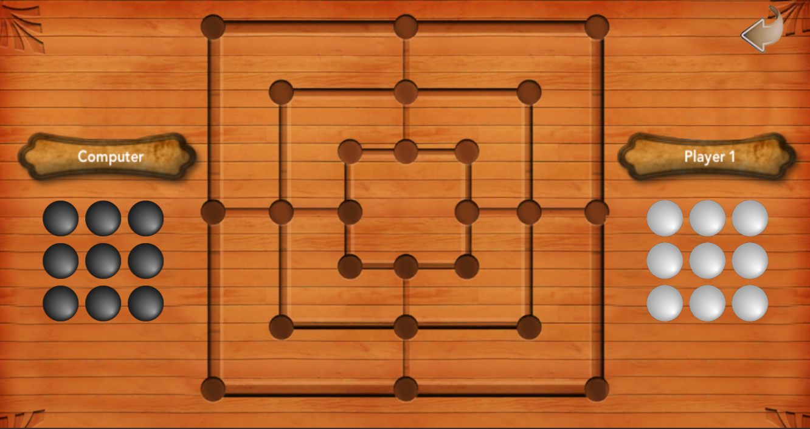

# Nine Mens Morris AI 
A simple AI for Nine Mens Morris game using minimax and alphabeta pruning search algorithms and cocos2d framework 

# Description :

A simple AI for nine mens morris using minimax and alphabeta pruning algorithms build from scratch for educational perposes.
This project presents my very first contact with artificial intelligence field, it also contants two console versions of the 
game to illustrate the difference between minimax and alphabeta in term of how much nodes every one processes.

This game is build from scratch using C++ language, it also contains a graphic and an android version build with cocos2d framework, 
the two players mode of the game in the graphic version is build using alphabeta pruning search algorithm and
 it plays pertty well game in the in-game.
 
# Components :

This repository contains :

- A [console version](./jeu_de_moulin_minimax_console) build using minimax pruning search algorithm
- A [console version](./jeu_de_moulin_alphabeta_console) build using alphabeta pruning search algorithm
- A an [android](./version_ANDROID) version of the game
- A [windows](./version_WINDOWS_and_source_code) version of the game
- [Code source](./version_WINDOWS_and_source_code) of the graphic version 

# Dependencies :
This project is portable and runs automatically.
To set the code source environnement you need to prepare all dependecies of [cocosd2](https://cocos2d-x.org/).

# Copyrights :

This repository is free to use for all purposes, you can redistribute it and/or modify it without any restrictions. 

Please feel free to contact us for any further informations or/and help about this repository. 
If you detected any bugs or you want to suggest some improvements in this go game repository, please feel to submit a pull request or contact me by email <harrymomment@gmail.com>

# Game's board :
 A screenshot of the game's board (3x3) :
 
 
 
 # Contribution :

Please feel free to fork the repository and make pull requests.
